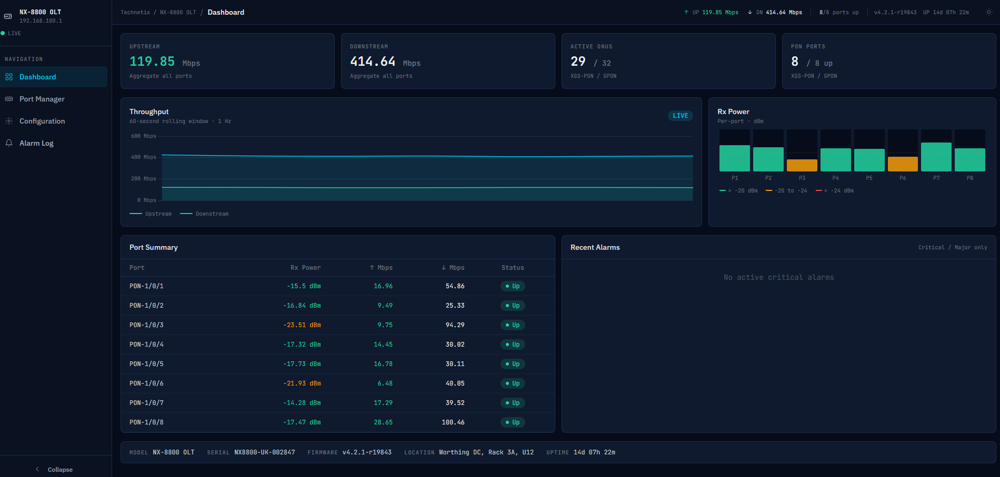

# OLT Manager · NX-8800

**A simulated web management dashboard for a fiber broadband OLT (Optical Line Terminal),** built as a frontend portfolio project demonstrating real-time data visualisation, form validation, and the architectural constraints of embedded device UI development.

🔗 **[Live Demo](https://cyberkatsu.github.io/network-device-dashboard/)** &nbsp;|&nbsp; Built with Svelte + Vite + TailwindCSS



---

## The Problem This Solves

Network equipment vendors (Calix, Adtran, CommScope, Nokia, Cisco) ship web management interfaces embedded directly in their hardware. These UIs run on constrained environments — the web server is a daemon on a MIPS or ARM SoC with limited RAM, no CDN, and a management Ethernet port the field engineer connects to directly.

In this context, a 2MB React + Redux bundle is not just slow — it can be genuinely incompatible with the device's memory constraints, or take 15 seconds to load over a 10Mbps management link. The choice of framework is therefore an engineering decision with real consequences, not a matter of preference.

This project demonstrates that I understand those constraints.

---

## Architecture Decisions

### Why Svelte, not React or Vue

Svelte compiles components to vanilla JavaScript at build time — there is no framework runtime shipped to the browser. The entire application, including Chart.js, compiles to approximately **~180KB gzipped** (see bundle analysis below).

An equivalent React application with hooks, react-dom, a charting library, and a state management layer typically lands at 400–600KB before your own code. On a device web UI, that difference matters.

```
Svelte:  your code + compiled output      → ~180KB gz
React:   react + react-dom + your code    → 130KB gz (framework alone)
```

Svelte also maps naturally to how embedded web UIs are often structured: self-contained components that compile to minimal DOM manipulation code, close to what you'd write by hand.

### Why a Web Worker for telemetry, not a mock REST API

A real OLT management agent streams telemetry either via WebSocket (`ws://device-ip/api/telemetry`) or Server-Sent Events. Polling a REST endpoint at 1 Hz is a valid alternative but wastes connection overhead and adds latency jitter.

Since GitHub Pages is static-only, I implemented a **Web Worker** that generates realistic time-series data and `postMessage`s it to the main thread at 1 Hz — the same rate a real SNMP poller or device agent would push updates.

The architectural benefit: the telemetry worker and the main thread are genuinely decoupled. Swapping the mock for a real WebSocket connection is a **one-line change** in `src/lib/stores/telemetry.js`:

```js
// Mock (current):
worker = new Worker(new URL('./telemetry.worker.js', import.meta.url), { type: 'module' })

// Production replacement:
const ws = new WebSocket('ws://192.168.100.1/api/telemetry')
ws.onmessage = ({ data }) => handleMessage(JSON.parse(data))
```

The Svelte stores, components, and charts are completely unaware of which transport is in use.

### Why Chart.js directly, not a wrapper library

Svelte-specific Chart.js wrappers (`svelte-chartjs` etc.) add an abstraction layer that makes fine-grained real-time update control harder. At 1 Hz with a 60-point rolling window, you need `chart.update('none')` — no animation — on every tick. Calling this directly is two lines; routing it through a reactive wrapper requires fighting the wrapper's own update cycle.

The `SignalBars` component (per-port Rx power display) is **pure Svelte + CSS** with no chart library at all. It's ~80 lines. A bargraph with thresholds and tooltips doesn't need a library; writing it directly is faster, lighter, and more maintainable.

### Why a single-bundle build (no code splitting)

In a standard web app, code splitting is a performance best practice — lazy-load routes so the initial page loads faster.

On an embedded device web UI, the opposite is often true. The management interface is typically loaded once per session by a single engineer. There's no benefit to deferring route chunks; it just adds round-trips over a potentially slow management link. A single bundle loads, parses once, and everything is immediately available.

---

## What This Demonstrates

| Capability | Where to look |
|---|---|
| Real-time data stream architecture | `src/lib/workers/telemetry.worker.js` + `src/lib/stores/telemetry.js` |
| Svelte reactive stores (equivalent to Redux, without the boilerplate) | `src/lib/stores/` |
| Chart.js real-time update pattern | `src/lib/components/charts/ThroughputChart.svelte` |
| Pure SVG/CSS data visualisation (no library) | `src/lib/components/charts/SignalBars.svelte` |
| Form validation with unsaved-changes guard | `src/routes/Configuration.svelte` |
| Responsive layout for tablet (768px) use case | `tailwind.config.js` + all route components |
| Realistic network domain data modelling | `src/lib/data/mockDevice.js` (ONU serials, dBm ranges, ITU-T conventions) |
| GitHub Actions CI/CD to Pages | `.github/workflows/deploy.yml` |

---

## Tech Stack

| Layer | Choice | Rationale |
|---|---|---|
| Framework | Svelte 5 + Vite | Zero runtime, compiled output |
| Styling | TailwindCSS (JIT, purged) | Utility-first; predictable bundle size |
| Charts | Chart.js (direct) | Fine-grained real-time control |
| Real-time | Web Worker (mock WebSocket) | Decoupled transport layer |
| State | Svelte stores + TypeScript | Typed payloads, built-in reactivity |
| Deployment | GitHub Actions → Pages | Static host, real CI pipeline |
| Fonts | IBM Plex Sans + JetBrains Mono | Technical aesthetic; monospace for data readouts |

---

## Domain Knowledge

The simulated data and UI conventions reflect real XGS-PON / GPON deployment parameters:

- **Rx power range**: −7 to −28 dBm (ITU-T G.9807.1 OLT sensitivity window)
- **Threshold model**: >−20 dBm good / −20 to −24 marginal / <−24 critical — standard for GPON Class B+
- **ONU serial format**: ITU-T G.984 compliant (4-char vendor ID + 8 hex digits, e.g. `COMS0000001A`)
- **Alarm codes**: LOS, RANGE_TIMEOUT, HIGH_BER, LOW_RX_PWR — standard OMCI / SNMP trap types
- **ONU states**: up / ranging / down — maps to G.984 ONU activation state machine
- **Bandwidth profile format**: upstream/downstream Mbps — matches TR-156 / TR-167 conventions

This reflects 15 years of experience with fiber broadband infrastructure products.

---

## Local Development

```bash
git clone https://github.com/yourusername/olt-dashboard
cd olt-dashboard
npm install
npm run dev
```

Open `http://localhost:5173`. The telemetry worker starts automatically and updates at 1 Hz.

```bash
npm run build     # Production build (outputs to dist/)
npm run preview   # Preview the production build locally
```

### Docker

To run the application using Docker Compose:

```bash
docker-compose up --build
```

The app will be available at `http://localhost:8080`.

---

## Bundle Analysis

After `npm run build`, Vite reports compressed bundle sizes. Target for this project:

| Chunk | Gzipped |
|---|---|
| `index.js` (Svelte app + stores) | ~85KB |
| `chart.js` (Chart.js library) | ~90KB |
| `index.css` (Tailwind purged) | ~8KB |
| **Total** | **~183KB** |

Compare to a typical React + Recharts equivalent: ~420KB gzipped.

---

## What I'd Improve With More Time

**Architecture**
- Replace the Web Worker mock with a real Node.js + `ws` WebSocket server (deployable to Render free tier), making the transport swap concrete rather than theoretical
- Add NETCONF/RESTCONF mock endpoints using `msw` (Mock Service Worker) for the configuration save/load flow
- Implement proper client-side routing with `svelte-routing` or SvelteKit's file-based router

**Features**
- ONU provisioning workflow: add/remove ONUs, assign bandwidth profiles, apply OMCI configuration
- Historical data persistence using `localStorage` for the alarm log and a configurable time window for charts
- Internationalisation (i18n) — real device UIs ship in 10+ languages; I have experience with multilingual web development
- Dark/light theme toggle — some field engineers prefer light mode outdoors

**Code Quality**
- TypeScript throughout — the store types and telemetry payload shape would benefit from strict typing
- Unit tests for the telemetry worker's data generation model and the configuration validation logic
- Accessibility audit — keyboard navigation for the port manager expand/collapse, ARIA labels on status indicators

---

## Background

I'm a Product Marketing Manager with 15 years at a fiber broadband infrastructure company (OLTs, ONUs, PON systems), recently graduated with an MSc in Computer Science. I've been doing frontend development for embedded device web UIs as part of my role, and this project demonstrates the intersection of those two backgrounds.

Certificates: JavaScript, Python, Java, C#, C++, C, Git/GitHub, Bash (Codecademy).

---

*Built over 2–3 weekends as a portfolio piece. Not affiliated with any real network equipment vendor.*
